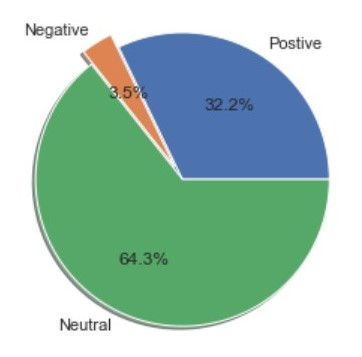

# Analysis of Indian PM Tweets
  Indian Prime Minister Mr.Narendra Modi is the 12th most followed person on Twiiter. **This repo is entirely apart from politics**. It's just for educational purpose.
  This project involves the following :
  1. ETL
  2. Visualize
  3. Classification
  4. Sentiment Analysis
  
  Libraries used :
  1. Tweepy
  2. wordcloud
  3. numpy
  4. pandas
  5. seaborn

## Extracting Tweets
  To extract data from the we should have a twitter developer account. After having an developer account generate the credentials and insert in the notebook as in the repo.
  Once the credentials and connections are triggered we are good to go.
  With this we can extract any twiiter handle. Here we focus on Indian PM.
  Every tweet has around 30 features such as tweet content , date , number of likes , retweets , device etc.,
 
 ## Transform and Analyse
  After extracting the tweets it's completely looks like messed up. Next step we have to transform the data so that it could be analysable. After transformation we do some statistical analysis of the tweets. 
  
  1. Mean of the tweet length
  2. Most liked tweet
  3. Most Retweeted tweet
  4. Plotting dates with likes
  5. plotting dates with retweets
  
  After doing some statisitical analysis let's do some correlation. The result medium length tweets gets more likes as well as retweets. 
  
 ## Sentiment Analysis
  There are three types of sentiment
  1. Positive
  2. Neutral
  3. Negative
  
  With this knowledge we loop over the tweets and using the **TextBlob** library we find the polarity of the tweet and classify accordingly. As a result
  1. Positive Tweets - 43.7%
  2. Negative tweets - 6.5%
  3. Neutral tweets - 49.8%

## Frequent words
  Let's find how many times he tweeted about **ELECTIONS**. He tweeted 20 times about the elections.
  
  
  
  Correlations between the tweet's features:
  
  
  
  Sentiment analysis result :
  
  

  Word cloud:
  
  Boxes are because of the Language mismatch. PM used Hindi and other languages also so wordcloud can't plot the other languages in the cloud.
  
  
 
## Conclusion

  Hope you enjoyed and learnt a lot. Things which can be added in the project:
  
  1. Classify tweets by devices.
  2. Word count by separate years.
  3. Deep analysis of Negative tweets.
  4. Extract State name mentioned frequently
  5. Finally your golden idea...

## Reference
Inspired by the article <a href="https://www.codementor.io/@ferrorodolfo/sentiment-analysis-on-trump-s-tweets-using-python-pltbvb4xr" target="_blank">Rodolfo Ferro</a>
 
 Thank You! Have a great day 😄
  
 
  
   

  
